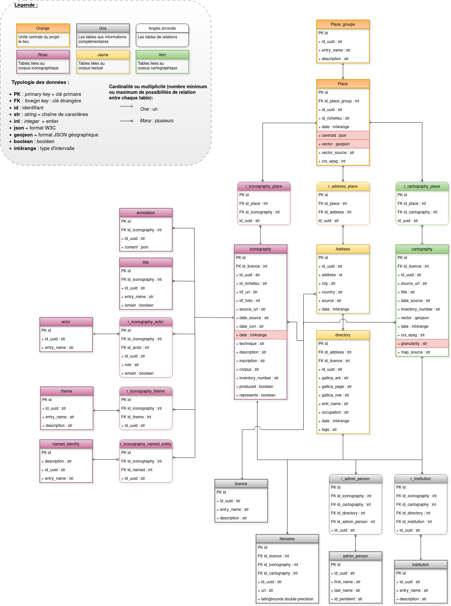

# Documentation du modèle de données (2024.12.17)

Modèle de données Richelieu (été 2024, crédits Marina Hervieu). Les colonnes `(theme|named_entity).category_slug` ont depuis été rajoutées.

## En général

La base de données comprend 23 tables. Certaines n'ont pas été remplies car elles correspondent à des fonctionnalités ou jeux de données qui n'ont au final pas été implémentées.

- **Les dates sont en [`int4range`](https://www.postgresql.org/docs/current/rangetypes.html)** (tranche d'integer, pour représenter des plages d'années). Cela permet de représenter à la fois les dates uniques (1923) et les tranches de dates (1923-1930).
  - les *bounds* sont `[)`: début de la tranche inclusive, fin non-inclusive.
  - *`[1923-1926)` = à partir de 1923 inclus et jusqu'à 1926 non-inclus*. Pour passer à une notation "normale", on devra donc rétroconvertir en `[1923,1925]`.
  - *`[1923-1924)` = 1924 (depuis 1923 inclus jusqu'à 1924 non-inclus)*
  - des fonctions existent dans le *back* et le *front* pour convertir de l'`int4range` au `List[int]`.

- **Les géocoordonnées sont stockées dans la base sous la forme de [géométries `GeoJSON`](https://en.wikipedia.org/wiki/GeoJSON#Geometries)** et le système de projection utilisé pour toutes les géométries est l'[EPSG:4326](https://epsg.io/4326).

Pour produire la description des tables ci-dessous, on utilise la requête [`query_extract_model.sql`](./query_extract_model.sql), qui produit un tableur. On complète ensuite le tableur avant de le transformer en liste à grands coups de regex.

---

## Description des tables

### actor
`actor` décrit les personnes et entités qui ont produit une ressource iconographique (auteur, autrice ou maison d’édition)
- **`actor.entry_name`**
	- **type PostgreSQL**: `text`
	- **champ nullable**
	- **description**: le nom de la personne ou entité
- **`actor.id`**
	- **type PostgreSQL**: `integer`
	- **champ nullable**
	- **description**: identifiant interne au format `\d+`
- **`actor.id_uuid`**
	- **type PostgreSQL**: `text`
	- **champ nullable**
	- **description**: identifiant public au format `qr1[a-z0-9]{32}`

### address
la table `address` décrit les adresses associées à un lieu
- **`address.address`**
	- **type PostgreSQL**: `text`
	- **champ nullable**
	- **description**: l’adresse en elle-même (nom et numéro de rue)
- **`address.city`**
	- **type PostgreSQL**: `text`
	- **champ nullable**
	- **description**: ville
- **`address.country`**
	- **type PostgreSQL**: `text`
	- **champ nullable**
	- **description**: pays
- **`address.date`**
	- **type PostgreSQL**: `int4range`
	- **champ nullable**
	- **description**: tranche de date sur lesquelles cette addresse est identifiée
- **`address.id`**
	- **type PostgreSQL**: `integer`
	- **champ nullable**
	- **description**: identifiant interne au format `\d+`
- **`address.id_uuid`**
	- **type PostgreSQL**: `text`
	- **champ nullable**
	- **description**: identifiant public au format `qr1[a-z0-9]{32}`
- **`address.source`**
	- **type PostgreSQL**: `text`
	- **champ nullable**
	- **description**: texte identifiant la source historique sur laquelle cette adresse est identifiée

### admin_person
`admin_person` recense les membres du projet et permet de suivre qui a édité quelle ressource (dans les faits, ces attributions ont été faites en « batch » : les crédits sont les mêmes pour toutes les ressources iconographiques
- **`admin_person.first_name`**
	- **type PostgreSQL**: `text`
	- **champ nullable**
	- **description**: prénom de la personne
- **`admin_person.id`**
	- **type PostgreSQL**: `integer`
	- **champ nullable**
	- **description**: identifiant interne au format `\d+`
- **`admin_person.id_persistent`**
	- **type PostgreSQL**: `text`
	- **champ nullable**
	- **description**: identifiant pérenne de la personne : soit un ORCID ou équivalent, soit, si rien n’est fourni, un UUID.
- **`admin_person.id_uuid`**
	- **type PostgreSQL**: `text`
	- **champ nullable**
	- **description**: identifiant public au format `qr1[a-z0-9]{32}`
- **`admin_person.last_name`**
	- **type PostgreSQL**: `text`
	- **champ nullable**
	- **description**: nom de famille de la personne

### annotation
`annotation` permet de stocker des annotations IIIF à ajouter à des documents. à ce state du projet, cette table est vide
- **`annotation.content`** : contenu de l'annotation
  - **type PostgreSQL**: json
	- **champ nullable**: YES
	- **description**: contenu de l’annotation, suivant la spécification IIIF pour les annotations
- **`annotation.id`**
	- **type PostgreSQL**: `integer`
	- **champ nullable**
	- **description**: identifiant interne au format `\d+`
- **`annotation.id_iconography`**
	- **type PostgreSQL**: `integer`
	- **champ nullable**
	- **description**: `iconography.id` : identifiant de la ressource iconographique sur laquelle porte cette annotation
- **`annotation.id_uuid`**
	- **type PostgreSQL**: `text`
	- **champ nullable**
	- **description**: identifiant public au format `qr1[a-z0-9]{32}`

### cartography
`cartography` contient les métadonnées des ressource cartographiques. Une ressource cartographique correspond à une géométrie correspondant à une parcelle issue d’une source historique précise
- **`cartography.crs_epsg`**
	- **type PostgreSQL**: `integer`
	- **champ nullable**
	- **description**: le code EPSG du système de projection utilisé pour la géométrie de la parcelle
- **`cartography.date`**
	- **type PostgreSQL**: `int4range`
	- **champ nullable**
	- **description**: la plage de dates sur laquelle cette parcelle existe
- **`cartography.date_source`**
	- **type PostgreSQL**: `text`
	- **champ nullable**
	- **description**: la date dans le document source
- **`cartography.granularity`**
	- **type PostgreSQL**: `text`
	- **champ nullable**
	- **description**: le niveau de granularité de cette parcelle (parcelle, galerie, aile…)
- **`cartography.id`**
	- **type PostgreSQL**: `integer`
	- **champ nullable**
	- **description**: identifiant interne au format `\d+`
- **`cartography.id_licence`**
	- **type PostgreSQL**: `integer`
	- **champ nullable**
	- **description**: une valeur de `licence.id`
- **`cartography.id_uuid`**
	- **type PostgreSQL**: `text`
	- **champ nullable**
	- **description**: identifiant public au format `qr1[a-z0-9]{32}`
- **`cartography.inventory_number`**
	- **type PostgreSQL**: `text`
	- **champ nullable**
	- **description**: le numéro d’inventaire de la source historique dans l’institution de conservation
- **`cartography.map_source`**
	- **type PostgreSQL**: `text`
	- **champ nullable**
	- **description**: texte identifiant la source historique à partir de laquelle cette ressource est produite
- **`cartography.source_url`**
	- **type PostgreSQL**: `text`
	- **champ nullable**
	- **description**: URL vers la page présentant la source sur le site de l’institution de conservation
- **`cartography.title`**
	- **type PostgreSQL**: `text`
	- **champ nullable**
	- **description**: titre donné à la ressource (souvent un titre générique)
- **`cartography.vector`**
	- **type PostgreSQL**: `json`
	- **champ nullable**
	- **description**: géométrie de la ressource, au format de Geometry GeoJSON

### directory
`directory` décrit les entrées de bottins et annuaires océrisés durant la première phase du projet. Dans les faits, du fait du volume de données et d’erreurs d’OCR, cette table est vide mais peut en théorie accueillir toutes les entrées d’annuaires OCRisés, avec une entrée par ligne de la table. La structure de donnée correspond à celle produite par Ravinitesh Anapureddy (EPFL)
- **`directory.date`**
	- **type PostgreSQL**: `int4range`
	- **champ nullable**
	- **description**: la date de l’entrée d’annuaire
- **`directory.entry_name`**
	- **type PostgreSQL**: `text`
	- **champ nullable**
	- **description**: le nom indiqué sur l’annuaire
- **`directory.gallica_ark`**
	- **type PostgreSQL**: `text`
	- **champ nullable**
	- **description**: ARK sur gallica BNF de l’annuaire
- **`directory.gallica_page`**
	- **type PostgreSQL**: `text`
	- **champ nullable**
	- **description**: page de l’annuaire sur Gallica
- **`directory.gallica_row`**
	- **type PostgreSQL**: `text`
	- **champ nullable**
	- **description**: ligne sur laquelle se trouve l’entrée
- **`directory.id`**
	- **type PostgreSQL**: `integer`
	- **champ nullable**
	- **description**: identifiant interne au format `\d+`
- **`directory.id_address`**
	- **type PostgreSQL**: `integer`
	- **champ nullable**
	- **description**: une valeur de `address.id`, permettant de pointer vers l’addresse à laquelle est liée l’entrée
- **`directory.id_licence`**
	- **type PostgreSQL**: `integer`
	- **champ nullable**
	- **description**: `licence.id`
- **`directory.id_uuid`**
	- **type PostgreSQL**: `text`
	- **champ nullable**
	- **description**: identifiant public au format `qr1[a-z0-9]{32}`
- **`directory.occupation`**
	- **type PostgreSQL**: `text`
	- **champ nullable**
	- **description**: occupation de la personne dans l’annuaire
- **`directory.tags`**
	- **type PostgreSQL**: `ARRAY`
	- **champ nullable**
	- **description**: liste de tags normalisés pour cette entrée

### filename
`filename` stocke les noms de fichiers associés aux ressources des tables `iconography` et `cartography`. Une entrée de `filename` peut être liée à une ressource iconographique OU cartographique
- **`filename.id`**
	- **type PostgreSQL**: `integer`
	- **champ nullable**
	- **description**: identifiant interne au format `\d+`
- **`filename.id_cartography`**
	- **type PostgreSQL**: `integer`
	- **champ nullable**
	- **description**: une valeur de `cartography.id` : identifiant de la ressource cartographique à laquelle est liée cette image
- **`filename.id_iconography`**
	- **type PostgreSQL**: `integer`
	- **champ nullable**
	- **description**: une valeur de `iconography.id` : identifiant de la ressource iconographique à laquelle est liée cette image
- **`filename.id_licence`**
	- **type PostgreSQL**: `integer`
	- **champ nullable**
	- **description**: `licence.id`
- **`filename.id_uuid`**
	- **type PostgreSQL**: `text`
	- **champ nullable**
	- **description**: identifiant public au format `qr1[a-z0-9]{32}`
- **`filename.latlngbounds`**
	- **type PostgreSQL**: `ARRAY`
	- **champ nullable**
	- **description**: géocoordonnées de la bounding box dans laquelle positionner cette image sur une carte
- **`filename.url`**
	- **type PostgreSQL**: `text`
	- **champ nullable**
	- **description**: nom du fichier image dans le serveur de l’INHA. Si le nom contient `_thumbnail`, c’est une image en petit format; si `_compress`, c’est une image en format moyen avec compression. Sinon, c’est une image en qualité maximale

### iconography
`iconography` décrit les ressources iconographiques sur le quartier. Une ressource iconographique est un document, ou une portion de document, qui est produite dans ou représente le quartier. Une ressource iconographique peut être composée de plusieurs images (recueils) ou d’une seule.
- **`iconography.corpus`**
	- **type PostgreSQL**: `text`
	- **champ nullable**
	- **description**: corpus ou collection à laquelle appartient la ressource
- **`iconography.date`**
	- **type PostgreSQL**: `int4range`
	- **champ nullable**
	- **description**: tranche de date sur lesquelles cette addresse est identifiée	tes de cette ressource
- **`iconography.date_corr`**
	- **type PostgreSQL**: `text`
	- **champ nullable**
	- **description**: date corrigée par le projet de cette ressource (non-normalisée)
- **`iconography.date_source`**
	- **type PostgreSQL**: `text`
	- **champ nullable**
	- **description**: date fournie par l’institution de conservation de la ressource (non-normalisée)
- **`iconography.description`**
	- **type PostgreSQL**: `text`
	- **champ nullable**
	- **description**: description de la ressource
- **`iconography.id`**
	- **type PostgreSQL**: `integer`
	- **champ nullable**
	- **description**: identifiant interne au format `\d+`
- **`iconography.id_licence`**
	- **type PostgreSQL**: `integer`
	- **champ nullable**
	- **description**: `licence.id`
- **`iconography.id_richelieu`**
	- **type PostgreSQL**: `text`
	- **champ nullable**
	- **description**: identifiant interne utilisé par le projet pendant la phase de constitution du corpus
- **`iconography.id_uuid`**
	- **type PostgreSQL**: `text`
	- **champ nullable**
	- **description**: identifiant public au format `qr1[a-z0-9]{32}`
- **`iconography.iiif_folio`**
	- **type PostgreSQL**: `ARRAY`
	- **champ nullable**
	- **description**: array de Integers ; cette colonne permet de filtrer un manifeste IIIF contenant seulement quelques images qui nous intéressent en fournissant une liste d’index des images pertinentes. Les index sont la position des canvas dans la `sequences[0]/canvases` du manifeste IIIF
- **`iconography.iiif_url`**
	- **type PostgreSQL**: `text`
	- **champ nullable**
	- **description**: URL du manifeste IIIF
- **`iconography.inscription`**
	- **type PostgreSQL**: `text`
	- **champ nullable**
	- **description**: inscriptions présentes sur le document
- **`iconography.inventory_number`**
	- **type PostgreSQL**: `text`
	- **champ nullable**
	- **description**: numéro d’inventaire dans l’institution de conservation
- **`iconography.produced`**
	- **type PostgreSQL**: `boolean`
	- **champ nullable**
	- **description**: si `True`, le document a été produit dans le quartier
- **`iconography.represents`**
	- **type PostgreSQL**: `boolean`
	- **champ nullable**
	- **description**: si `True`, le document représente le quartier
- **`iconography.source_url`**
	- **type PostgreSQL**: `text`
	- **champ nullable**
	- **description**: URL de la ressource sur le site de l’institution de conservation
- **`iconography.technique`**
	- **type PostgreSQL**: `ARRAY`
	- **champ nullable**
	- **description**: array de Text : liste des techniques utilisées pour produire le document

### institution
`institution` décrit les institutions de conservation chez lesquelles les ressources iconographiques et cartographiques ont été trouvées
- **`institution.description`**
	- **type PostgreSQL**: `text`
	- **champ nullable**
	- **description**: description en texte libre
- **`institution.entry_name`**
	- **type PostgreSQL**: `text`
	- **champ nullable**
	- **description**: nom canonique de l’institution
- **`institution.id`**
	- **type PostgreSQL**: `integer`
	- **champ nullable**
	- **description**: identifiant interne au format `\d+`
- **`institution.id_uuid`**
	- **type PostgreSQL**: `text`
	- **champ nullable**
	- **description**: identifiant public au format `qr1[a-z0-9]{32}`

### licence
`licence` décrit les droits d’accès d’une ressource
- **`licence.description`**
	- **type PostgreSQL**: `text`
	- **champ nullable**
	- **description**: description ou URL de la licence
- **`licence.entry_name`**
	- **type PostgreSQL**: `text`
	- **champ nullable**
	- **description**: nom canonique
- **`licence.id`**
	- **type PostgreSQL**: `integer`
	- **champ nullable**
	- **description**: identifiant interne au format `\d+`
- **`licence.id_uuid`**
	- **type PostgreSQL**: `text`
	- **champ nullable**
	- **description**: identifiant public au format `qr1[a-z0-9]{32}`

### named_entity
`named_entity` décrit les entités nommées, des points d’intérêts (personnes, commerces, lieux...) identifiés dans des images
- **`named_entity.category`**
	- **type PostgreSQL**: `text`
	- **champ nullable**
	- **description**: catégorie à laquelle appartient cette entité nommée. Une catégorie regroupe plusieurs entités nommées
- **`named_entity.category_slug`**
	- **type PostgreSQL**: `text`
	- **champ nullable**
	- **description**: la catégorie, avec seulement des caractères valides à utiliser dans les URL de l’application
- **`named_entity.description`**
	- **type PostgreSQL**: `text`
	- **champ nullable**
	- **description**: description de l’entité nommée
- **`named_entity.entry_name`**
	- **type PostgreSQL**: `text`
	- **champ nullable**
	- **description**: nom canonique
- **`named_entity.id`**
	- **type PostgreSQL**: `integer`
	- **champ nullable**
	- **description**: identifiant interne au format `\d+`
- **`named_entity.id_uuid`**
	- **type PostgreSQL**: `text`
	- **champ nullable**
	- **description**: identifiant public au format `qr1[a-z0-9]{32}`

### place
`place` décrit les différents lieux du quartier. Un lieu est défini par son empreinte au sol et la durée pendant laquelle il existe. Un lieu existe indépendamment des sources historiques. Il peut être représenté par plusieurs ressources cartographiques (le 14 rue Vivienne dans l’atlas Vasserot et le parcellaire municipal fin XIXe siècle).
- **`place.centroid`**
	- **type PostgreSQL**: `json`
	- **champ nullable**
	- **description**: le centroïde du lieu
- **`place.crs_epsg`**
	- **type PostgreSQL**: `integer`
	- **champ nullable**
	- **description**: le code EPSG du système de projection utilisé pour la géométrie
- **`place.date`**
	- **type PostgreSQL**: `int4range`
	- **champ nullable**
	- **description**: la tranche de date sur laquelle ce lieu est identifié
- **`place.id`**
	- **type PostgreSQL**: `integer`
	- **champ nullable**
	- **description**: identifiant interne au format `\d+`
- **`place.id_place_group`**
	- **type PostgreSQL**: `integer`
	- **champ nullable**
	- **description**: `place_group.id`
- **`place.id_richelieu`**
	- **type PostgreSQL**: `text`
	- **champ nullable**
	- **description**: identifiant interne utilisé par le projet pendant la phase de constitution du corpus
- **`place.id_uuid`**
	- **type PostgreSQL**: `text`
	- **champ nullable**
	- **description**: identifiant public au format `qr1[a-z0-9]{32}`
- **`place.vector`**
	- **type PostgreSQL**: `json`
	- **champ nullable**
	- **description**: géométrie du lieu, au format de Geometry GeoJSON
- **`place.vector_source`**
	- **type PostgreSQL**: `text`
	- **champ nullable**
	- **description**: mot clé indiquant la source historique d’où a été extraite la géométrie

### place_group
`place_group` permet de regrouper ensemble plusieurs lieux (les différentes parcelles du Palais-Royal, par exemple). Dans les faits, cette table n’est pas utilisée
- **`place_group.description`**
	- **type PostgreSQL**: `text`
	- **champ nullable**
	- **description**: description du groupe
- **`place_group.entry_name`**
	- **type PostgreSQL**: `text`
	- **champ nullable**
	- **description**: nom canonique
- **`place_group.id`**
	- **type PostgreSQL**: `integer`
	- **champ nullable**
	- **description**: identifiant interne au format `\d+`
- **`place_group.id_uuid`**
	- **type PostgreSQL**: `text`
	- **champ nullable**
	- **description**: identifiant public au format `qr1[a-z0-9]{32}`

### r_address_place
`r_address_place` : relation entre `address` et `place`
- **`r_address_place.id`**
	- **type PostgreSQL**: `integer`
	- **champ nullable**
	- **description**: identifiant interne au format `\d+`
- **`r_address_place.id_address`**
	- **type PostgreSQL**: `integer`
	- **champ nullable**
	- **description**: `address.id`
- **`r_address_place.id_place`**
	- **type PostgreSQL**: `integer`
	- **champ nullable**
	- **description**: `place.id`
- **`r_address_place.id_uuid`**
	- **type PostgreSQL**: `text`
	- **champ nullable**
	- **description**: identifiant public au format `qr1[a-z0-9]{32}`

### r_admin_person
`r_admin_person` : relation de `admin_person` à `cartography`, `directory` et `iconography`
- **`r_admin_person.id`**
	- **type PostgreSQL**: `integer`
	- **champ nullable**
	- **description**: identifiant interne au format `\d+`
- **`r_admin_person.id_admin_person`**
	- **type PostgreSQL**: `integer`
	- **champ nullable**
	- **description**: `admin_person.id`
- **`r_admin_person.id_cartography`**
	- **type PostgreSQL**: `integer`
	- **champ nullable**
	- **description**: `cartography.id`
- **`r_admin_person.id_directory`**
	- **type PostgreSQL**: `integer`
	- **champ nullable**
	- **description**: `directory.id`
- **`r_admin_person.id_iconography`**
	- **type PostgreSQL**: `integer`
	- **champ nullable**
	- **description**: `iconography.id`
- **`r_admin_person.id_uuid`**
	- **type PostgreSQL**: `text`
	- **champ nullable**
	- **description**: identifiant public au format `qr1[a-z0-9]{32}`

### r_cartography_place
`r_cartography_place` : relation entre `cartography` et `place`
- **`r_cartography_place.id`**
	- **type PostgreSQL**: `integer`
	- **champ nullable**
	- **description**: identifiant interne au format `\d+`
- **`r_cartography_place.id_cartography`**
	- **type PostgreSQL**: `integer`
	- **champ nullable**
	- **description**: `cartography.id`
- **`r_cartography_place.id_place`**
	- **type PostgreSQL**: `integer`
	- **champ nullable**
	- **description**: `place.id`
- **`r_cartography_place.id_uuid`**
	- **type PostgreSQL**: `text`
	- **champ nullable**
	- **description**: identifiant public au format `qr1[a-z0-9]{32}`

### r_iconography_actor
`r_iconography_actor` : relation entre `iconography` et `actor`
- **`r_iconography_actor.id`**
	- **type PostgreSQL**: `integer`
	- **champ nullable**
	- **description**: identifiant interne au format `\d+`
- **`r_iconography_actor.id_actor`**
	- **type PostgreSQL**: `integer`
	- **champ nullable**
	- **description**: `actor.id`
- **`r_iconography_actor.id_iconography`**
	- **type PostgreSQL**: `integer`
	- **champ nullable**
	- **description**: `iconography.id`
- **`r_iconography_actor.id_uuid`**
	- **type PostgreSQL**: `text`
	- **champ nullable**
	- **description**: identifiant public au format `qr1[a-z0-9]{32}`
- **`r_iconography_actor.ismain`**
	- **type PostgreSQL**: `boolean`
	- **champ nullable**
	- **description**: Si `True`, l’`actor` de la relation est l’auteur principal de la ressource iconographique. Sert à hiérarchiser les auteur.ice.s multiples
- **`r_iconography_actor.role`**
	- **type PostgreSQL**: `text`
	- **champ nullable**
	- **description**: "rôle de l’`actor`: « author » ou « publisher"""

### r_iconography_named_entity
`r_iconography_named_entity` : relation entre `iconography` et `named_entity`
- **`r_iconography_named_entity.id`**
	- **type PostgreSQL**: `integer`
	- **champ nullable**
	- **description**: identifiant interne au format `\d+`
- **`r_iconography_named_entity.id_iconography`**
	- **type PostgreSQL**: `integer`
	- **champ nullable**
	- **description**: `iconography.id`
- **`r_iconography_named_entity.id_named_entity`**
	- **type PostgreSQL**: `integer`
	- **champ nullable**
	- **description**: `named_entity.id`
- **`r_iconography_named_entity.id_uuid`**
	- **type PostgreSQL**: `text`
	- **champ nullable**
	- **description**: identifiant public au format `qr1[a-z0-9]{32}`

### r_iconography_place
`r_iconography_place` : relation entre `iconography` et `place`
- **`r_iconography_place.id`**
	- **type PostgreSQL**: `integer`
	- **champ nullable**
	- **description**: identifiant interne au format `\d+`
- **`r_iconography_place.id_iconography`**
	- **type PostgreSQL**: `integer`
	- **champ nullable**
	- **description**: `iconography.id`
- **`r_iconography_place.id_place`**
	- **type PostgreSQL**: `integer`
	- **champ nullable**
	- **description**: `place.id`
- **`r_iconography_place.id_uuid`**
	- **type PostgreSQL**: `text`
	- **champ nullable**
	- **description**: identifiant public au format `qr1[a-z0-9]{32}`

### r_iconography_theme
`r_iconography_theme` : relation entre `iconography` et `theme`
- **`r_iconography_theme.id`**
	- **type PostgreSQL**: `integer`
	- **champ nullable**
	- **description**: identifiant interne au format `\d+`
- **`r_iconography_theme.id_iconography`**
	- **type PostgreSQL**: `integer`
	- **champ nullable**
	- **description**: `iconography.id`
- **`r_iconography_theme.id_theme`**
	- **type PostgreSQL**: `integer`
	- **champ nullable**
	- **description**: `theme.id`
- **`r_iconography_theme.id_uuid`**
	- **type PostgreSQL**: `text`
	- **champ nullable**
	- **description**: identifiant public au format `qr1[a-z0-9]{32}`

### r_institution
`r_institution` : relation de `institution` à `cartography`, `directory` et `iconography`
- **`r_institution.id`**
	- **type PostgreSQL**: `integer`
	- **champ nullable**
	- **description**: identifiant interne au format `\d+`
- **`r_institution.id_cartography`**
	- **type PostgreSQL**: `integer`
	- **champ nullable**
	- **description**: `cartography.id`
- **`r_institution.id_directory`**
	- **type PostgreSQL**: `integer`
	- **champ nullable**
	- **description**: `directory.id`
- **`r_institution.id_iconography`**
	- **type PostgreSQL**: `integer`
	- **champ nullable**
	- **description**: `iconography.id`
- **`r_institution.id_institution`**
	- **type PostgreSQL**: `integer`
	- **champ nullable**
	- **description**: `institution.id`
- **`r_institution.id_uuid`**
	- **type PostgreSQL**: `text`
	- **champ nullable**
	- **description**: identifiant public au format `qr1[a-z0-9]{32}`

### theme
`theme` : thématique ou concept à laquelle se rapporte une ressource iconographique. Là où une `named_entity` doit être une chose qui existe, le thème est simplement un concept auquel se rattache une image
- **`theme.category`**
	- **type PostgreSQL**: `text`
	- **champ nullable**
	- **description**: catégorie à laquelle appartient ce thème. Une catégorie regroupe plusieurs thèmes
- **`theme.category_slug`**
	- **type PostgreSQL**: `text`
	- **champ nullable**
	- **description**: la catégorie, avec seulement des caractères valides à utiliser dans les URL de l’application
- **`theme.description`**
	- **type PostgreSQL**: `text`
	- **champ nullable**
	- **description**: description du thème
- **`theme.entry_name`**
	- **type PostgreSQL**: `text`
	- **champ nullable**
	- **description**: nom canonique
- **`theme.id`**
	- **type PostgreSQL**: `integer`
	- **champ nullable**
	- **description**: identifiant interne au format `\d+`
- **`theme.id_uuid`**
	- **type PostgreSQL**: `text`
	- **champ nullable**
	- **description**: identifiant public au format `qr1[a-z0-9]{32}`

### title
`title` : titre d’une ressource iconographique. Une table à part est crée pour permettre d’avoir plusieurs titres par document
- **`title.entry_name`**
	- **type PostgreSQL**: `text`
	- **champ nullable**
	- **description**: le titre en lui-même
- **`title.id`**
	- **type PostgreSQL**: `integer`
	- **champ nullable**
	- **description**: identifiant interne au format `\d+`
- **`title.id_iconography`**
	- **type PostgreSQL**: `integer`
	- **champ nullable**
	- **description**: `iconography.id`
- **`title.id_uuid`**
	- **type PostgreSQL**: `text`
	- **champ nullable**
	- **description**: identifiant public au format `qr1[a-z0-9]{32}`
- **`title.ismain`**
	- **type PostgreSQL**: `boolean`
	- **champ nullable**
	- **description**: si `True`, le titre est le titre principal de la ressource.
